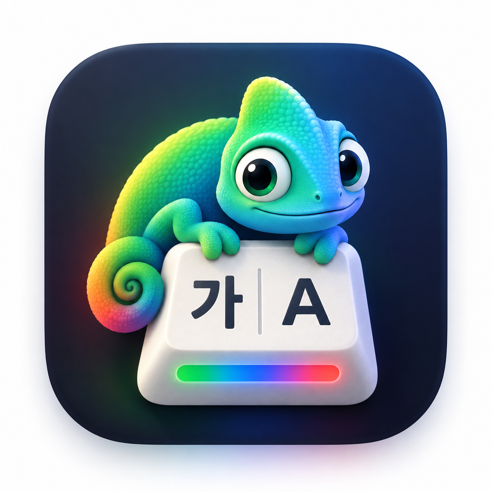

<p align="center">
  
</p>

<h1 align="center">KeyHue</h1>

<p align="center">
  <b>타이핑하기 전에, 지금 어떤 언어로 입력될지 알 수 있다.</b><br>
  현재 입력 소스의 색으로 화면 가장자리를 칠해 주는 작은 macOS 메뉴바 앱.
</p>

<p align="center">
  <a href="https://sejoung.github.io/KeyHue/ko.html"><b>다운로드</b></a> ·
  <a href="https://sejoung.github.io/KeyHue/manual-ko.html">사용 설명서</a> ·
  <a href="README.md">English</a> · 한국어
</p>

---

한/영을 오가며 쓰다 보면 문장 하나를, 또는 터미널 명령을 통째로 엉뚱한 언어로 쳐 본 경험이 있을 겁니다. 메뉴바의 입력 소스 표시는 작아서 잘 보이지 않습니다. 일본어·중국어·러시아어 사용자나 German/US 배열을 섞어 쓰는 사람도 마찬가지입니다.

KeyHue는 **macOS에서 실제로 선택된 입력 소스**를 화면 가장자리의 얇은 색 라인으로 보여줘서, 시선을 옮기지 않고도 알 수 있게 합니다. 한/영 키를 눌렀는데 실제로 전환되지 않았다면 색도 바뀌지 않습니다.

## 기능

- **상태 바**: 모든 모니터 가장자리에 얇은 색 라인을 표시합니다. 기본은 하단이고 상단·왼쪽·오른쪽으로 옮길 수 있습니다. 두께(1–16px)와 불투명도도 조절할 수 있습니다.
- **입력 소스별 색**: 시스템 설정에서 켜 둔 입력 소스마다 색을 지정합니다. 기본값은 영문 배열 파랑, 한국어 초록, 일본어 주황, 중국어 보라, 키릴 문자 청록 등입니다.
- **Caps Lock**: 켜져 있으면 입력 소스 색보다 우선해 빨강으로 표시합니다.
- **메뉴바 카멜레온**: 메뉴바 아이콘도 입력 소스에 따라 색이 바뀝니다.
- **자동 전환** (선택): 다음 상황에서 기본 입력 소스로 되돌립니다. 기본은 ABC이고 바꿀 수 있습니다.
  - 앱을 전환할 때
  - ESC를 누를 때 (Vim, VS Code, 터미널에서 유용합니다)
  - 텍스트 필드를 벗어날 때 (실험적)
- **앱별 입력 기억** (선택): 앱으로 돌아오면 그 앱에서 마지막으로 쓰던 입력 소스를 복원합니다.
- **HUD** (선택): 입력 소스가 바뀌는 순간 `가 / あ / 中 / Я / a`를 잠깐 표시합니다.
- **다국어**: English, 한국어, 日本語를 지원합니다. macOS 언어와 다르게 앱 언어만 따로 고를 수 있습니다.
- **가벼움**: 네이티브 Swift/AppKit이고 polling 없이 이벤트로만 동작합니다. 대기 중 CPU는 거의 0%입니다. 외부 의존성과 네트워크가 없습니다.

## 개인정보

**KeyHue는 입력한 내용을 절대 기록하지 않습니다.**

| 기능 | KeyHue가 읽는 것 | 권한 |
|---|---|---|
| 상태 바, Caps Lock, 앱 전환 | 현재 선택된 입력 소스, Caps Lock 상태, 활성 앱 | 없음 |
| ESC로 전환 | 누른 키가 ESC인지 여부만 (문자는 읽지 않는 관찰 전용 이벤트 탭) | 입력 모니터링 |
| 텍스트 필드를 벗어나면 전환 (실험적) | 포커스된 요소의 *종류*(예: "텍스트 필드")만, 내용은 읽지 않음 | 손쉬운 사용 |

권한은 해당 기능을 켤 때만 요청합니다. 네트워크 코드와 분석 도구가 없고, 소스 코드로 직접 확인할 수 있습니다.

## 요구 사항

- macOS 13 Ventura 이상 (Apple silicon, Intel)

## 설치

### 내려받기

1. [KeyHue 웹사이트](https://sejoung.github.io/KeyHue/ko.html)(또는 [Releases](https://github.com/sejoung/KeyHue/releases/latest))에서 최신 버전을 내려받아 압축을 풀고, **KeyHue.app**을 **응용 프로그램** 폴더로 옮깁니다. 모든 옵션은 [사용 설명서](https://sejoung.github.io/KeyHue/manual-ko.html)에 있습니다.
2. 릴리즈 빌드는 **Apple Developer ID 서명·공증이 없습니다**(무료 오픈소스 개인 프로젝트). 그래서 처음 열 때 macOS가 실행을 막습니다.
   - **macOS 15 이상**: KeyHue를 한 번 연 뒤 **시스템 설정 › 개인정보 보호 및 보안**에서 **그래도 열기**를 누릅니다.
   - **macOS 13–14**: KeyHue.app을 Control-클릭 › **열기** › **열기**.
   - 또는: `xattr -dr com.apple.quarantine /Applications/KeyHue.app`

   릴리즈에 첨부된 `.sha256` 파일로 zip을 확인하거나, 소스에서 직접 빌드할 수도 있습니다.

### 소스에서 빌드

```bash
git clone https://github.com/sejoung/KeyHue.git
cd KeyHue
scripts/build-app.sh          # → build/KeyHue.app
open build/KeyHue.app
```

KeyHue는 메뉴바에 카멜레온 아이콘으로, Dock에도 앱 아이콘으로 나타납니다. Dock 아이콘을 누르거나 카멜레온 메뉴의 **설정… (⌘,)**에서 색, 위치, 자동 전환을 바꿀 수 있습니다. 메뉴바에만 두고 싶다면 **Dock에 표시**를 끄세요.

> 개발 인증서가 없으면 로컬 빌드는 ad-hoc 서명이라, 다시 빌드할 때마다 macOS가 입력 모니터링·손쉬운 사용 권한을 잊습니다. `scripts/signing.sh create`를 한 번 실행하면 이후 빌드에서도 권한이 유지됩니다.

## 알려진 한계

- KeyHue는 **macOS가 알려주는** 입력 소스를 따릅니다. 입력 소스를 바꾸지 않고 한 입력기 안에서만 모드를 바꾸는 경우(예: 일부 중국어 입력기의 Shift 전환)는 감지할 수 없습니다.
- 입력 소스가 많으면 색만으로 구분하기 어려울 수 있습니다. 패턴·두께로 구분하는 기능을 검토하고 있습니다.
- 노치가 있는 MacBook에서는 상단 막대가 노치 부분에서 끊겨 보입니다.

## 개발

요구 사항: Xcode 16+ (Swift 6 toolchain)

```bash
swift test                    # 단위 테스트 (KeyHueCore)
scripts/build-app.sh          # .app 번들 빌드
scripts/install.sh            # 빌드 → /Applications에 설치 → 다시 실행
scripts/verify.sh             # build + test + bundle, 로그는 TestResults/
```

```text
Sources/KeyHueCore   상태 모델, 입력 소스 색, 자동 전환 정책, 설정 (순수 로직, 테스트 대상)
Sources/KeyHue       AppKit/Carbon 런타임: 모니터, 상태 바, HUD, 메뉴바, 설정 창(SwiftUI)
Resources/           Info.plist 템플릿, en/ko/ja 번역
scripts/             빌드·검증·릴리즈·공증 스크립트
site/                웹사이트와 사용 설명서(GitHub Pages), 스크린샷은 scripts/screenshots.sh로 생성
docs/SPEC.md         제품 명세
docs/adr/            설계 결정 기록(ADR)
```

### 릴리즈 (관리자용)

버전은 [`VERSION`](VERSION) 파일로 관리하고, 태그는 `vX.Y.Z` 형식입니다. `release.sh`는 실제 빌드와 테스트가 통과해야 커밋·태그·push합니다. 태그가 push되면 [Release workflow](.github/workflows/release.yml)가 다시 테스트하고, universal 앱을 만들어 GitHub Releases에 게시합니다. 릴리즈 노트는 태그 메시지로 채웁니다.

```bash
scripts/release.sh patch --dry-run    # 검사 + 빌드 + 테스트만
scripts/release.sh patch|minor|major  # 버전 올리기 → 검증 → 커밋 → 태그 → push → Actions가 릴리즈 게시
scripts/package.sh                    # 같은 universal zip을 로컬에서 만들기 (build/dist/)
```

#### 서명 키

업데이트 후에도 macOS가 입력 모니터링·손쉬운 사용 권한을 유지하도록, 릴리즈는 자체 서명 인증서로 서명합니다. 이 인증서가 없으면 빌드마다 서명이 바뀌어 사용자가 권한을 다시 허용해야 합니다. 키는 저장소에 들어가지 않습니다.

```bash
scripts/signing.sh create     # 최초 1회: 키 생성 → ~/.config/keyhue/ 보관, 키체인 등록
scripts/signing.sh github     # 저장소 Actions secrets에 KEYHUE_SIGNING_P12 / KEYHUE_SIGNING_PASSWORD 등록
scripts/signing.sh install    # 다른 Mac: ~/.config/keyhue/를 안전하게 복사한 뒤 등록
```

Secrets가 없으면 Release workflow는 경고를 남기고 ad-hoc으로 서명합니다. `scripts/notarize.sh`는 나중에 Apple Developer 계정이 생기면 쓸 Developer ID 서명·공증용입니다.

자세한 내용은 [ADR 0017](docs/adr/0017-distribution-developer-id-notarization.md)을 참고하세요.

## 기여

이슈와 PR을 환영합니다. 특히 번역과 다른 언어의 기본 색 제안이 도움이 됩니다. [CONTRIBUTING.md](CONTRIBUTING.md)를 참고하세요.

## 라이선스

소스 코드는 [MIT 라이선스](LICENSE)로 공개합니다.

**KeyHue라는 이름과 앱 아이콘**(`docs/icon.png`와 이를 바탕으로 생성되는 아이콘)은 MIT 라이선스 대상이 아닙니다. 수정한 버전을 배포할 때는 다른 이름과 아이콘을 써 주세요.
