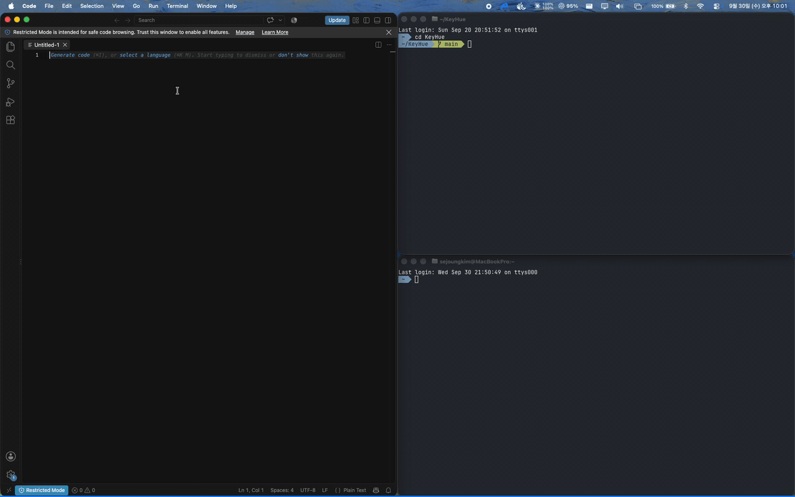

<p align="center">
  
</p>

<h1 align="center">KeyHue</h1>

<p align="center">
  <b>Know which language you're about to type in, before you type.</b><br>
  A tiny macOS menu bar app that paints the edge of your screen with the color of the current input source.
</p>

<p align="center">
  <a href="https://github.com/sejoung/KeyHue/releases/latest"></a>
  <a href="https://github.com/sejoung/KeyHue/releases/latest"></a>
  <a href="https://github.com/sejoung/KeyHue/actions/workflows/ci.yml"></a>
  <a href="#requirements"></a>
  <a href="LICENSE"></a>
</p>

<p align="center">
  <a href="https://sejoung.github.io/KeyHue/"><b>Download</b></a> ·
  <a href="https://sejoung.github.io/KeyHue/manual.html">Manual</a> ·
  English · <a href="README.ko.md">한국어</a>
</p>

<p align="center">
  
  <br>
  <em>Remember the input language for each app and window. See the current language at a glance.</em>
</p>

---

If you switch between keyboard input sources (Korean ↔ English, Japanese ↔ English, Russian ↔ English, German ↔ U.S., …), you have probably typed a whole sentence, or a terminal command, in the wrong one. The input source indicator in the macOS menu bar is small and easy to miss.

KeyHue shows the **actual input source selected in macOS** as a thin colored line at the edge of your screen, so you can see it out of the corner of your eye. If you pressed the switch key and the switch didn't happen, the color doesn't change either.

## Features

- **State bar**: a thin colored line on every display (bottom by default; top, left or right if you prefer). You can change its thickness (1–16 px) and opacity.
- **A color for each input source**: every input source enabled in System Settings gets its own color. Sensible defaults: Latin layouts blue, Korean green, Japanese orange, Chinese purple, Cyrillic teal, and so on.
- **Caps Lock**: shown in red, on top of the input source color.
- **Menu bar chameleon**: the menu bar icon changes color with the input source.
- **When you switch apps, or windows of the same app** (optional, pick one for each):
  - **Keep As Is**
  - **Switch to ABC**: your default input source (ABC by default, configurable)
  - **Restore Last Input Source**: whatever you last used in that app or window, for example Korean in one Terminal window and English in another. Apps and windows KeyHue hasn't seen switch to ABC. Windows are remembered until KeyHue quits.
- **Switch to ABC on ESC** (optional): handy in Vim, VS Code and terminals.
- **Switch to ABC when leaving a text field** (optional, experimental).
- **Warn when Korean and English are mixed up** (optional, experimental, **for Korean users**: needs 2-Set Korean together with a QWERTY English layout, or the two KeyHue input method modes, and is hidden otherwise): if a word looks like it's being typed in the other mode (`dkssud` → 안녕, `ㅗ디ㅣㅐ` → hello), the bar blinks in that language's color and a small message shows it in that language, usually within the first 3–4 keys (`dks` → 안…?, `he` → he…?). The message can be turned off. Nothing you typed is changed.
- **HUD** (optional): the chameleon pops up briefly in the new input source's color when you switch.
- **Localized**: English, 한국어 and 日本語. The app language can differ from the macOS language.
- **Lightweight**: native Swift/AppKit with event-driven input indicators and no input polling. Idle CPU is about 0%. No external dependencies. Update checks contact GitHub at most once a day automatically and can be turned off.
- **Update notices**: checks for a new release once a day. Choose **Check for Updates…** below Settings in the menu, or use **Settings › General › Updates**. When a newer version is available, **Download New Version** opens its release page. Download the ZIP, quit KeyHue, and replace the app in Applications. KeyHue does not install updates automatically.

## Privacy

**KeyHue never records what you type.**

| Feature | What KeyHue reads | Permission |
|---|---|---|
| State bar, Caps Lock, app switch | The currently selected input source, Caps Lock state, which app is active | None |
| Switch on ESC | Only whether the pressed key is ESC (a listen-only event tap; no characters are read) | Input Monitoring |
| When switching windows of the same app | Only that the app's main window changed (window titles and contents are never read) | Accessibility |
| Switch when leaving a text field (experimental) | Only the *role* of the focused UI element (e.g. "text field"), never its contents | Accessibility |
| Warn when Korean and English are mixed up (experimental, Korean input) | Key *positions* of the word being typed (no characters), plus mouse clicks to know the cursor moved. The word stays in memory only until it ends, is shown on screen in the warning, and is never stored, logged or sent. To avoid false alarms on commands like `dirname`, it also reads the *file names* in the system and Homebrew command folders (`/usr/bin`, `/opt/homebrew/bin`, …) | Input Monitoring |
| KeyHue input method and word fixing (experimental) | Keys typed while a KeyHue mode is selected, composed in memory. When you press the fix shortcut, the selection or the word before the cursor (in terminals, the keys the input method just received); it is discarded after the fix and never logged or sent. Only if you turn on **Record Undone Fixes** (off by default, automatic fixing) are fixes you undid (typed word, fix, app) kept on this Mac, up to 50; turning it off deletes them | Accessibility for KeyHue (fixing in terminals only) |

For troubleshooting, KeyHue keeps a local log (`~/Library/Logs/KeyHue/`, at most 3 MB) of app and window switches, input source changes and automatic switches. It contains app bundle IDs and input source IDs, never what you type or window titles, and is never sent anywhere. **Show Log File** in Settings › General reveals it.

Permissions are requested only when you turn on the feature that needs them. KeyHue only contacts GitHub to check public releases, automatically once a day or when you choose **Check for Updates…**. Turn automatic checks off in **Settings › General**. No typing, app activity or logs are sent, and there are no analytics. The source code is here for you to verify.

## Requirements

- macOS 13 Ventura or later (Apple silicon and Intel)

## Install

### Download

1. Download the latest version from the [KeyHue website](https://sejoung.github.io/KeyHue/) (or [Releases](https://github.com/sejoung/KeyHue/releases/latest)), unzip it, and move **KeyHue.app** to **Applications**. The [manual](https://sejoung.github.io/KeyHue/manual.html) covers every option.
2. The release builds are **not signed with an Apple Developer ID and not notarized** (KeyHue is a free, open-source side project), so macOS blocks the first launch:
   - **macOS 15 Sequoia or later**: open KeyHue once, then go to **System Settings › Privacy & Security** and click **Open Anyway**.
   - **macOS 13–14**: Control-click KeyHue.app › **Open** › **Open**.
   - Or: `xattr -dr com.apple.quarantine /Applications/KeyHue.app`

   You can check the zip against the `.sha256` file attached to the release, or build it yourself from the source.

### Build from source

```bash
git clone https://github.com/sejoung/KeyHue.git
cd KeyHue
scripts/build-app.sh          # → build/KeyHue.app
open build/KeyHue.app
```

KeyHue shows a chameleon in the menu bar. Choose **Settings… (⌘,)** from the chameleon menu, or open KeyHue again, to change colors, position and automation. While the settings window is open, KeyHue also shows in the Dock. Turn on **Show in Dock** to keep it there all the time.

> Local builds are ad-hoc signed unless you create a development certificate. With ad-hoc signing, macOS forgets the Input Monitoring / Accessibility permission after every rebuild. Run `scripts/signing.sh create` once and later builds keep the permission.

## Known limitations

- KeyHue follows the input source that **macOS reports**. If an input method switches modes internally without changing the input source (for example Shift in some Chinese input methods), KeyHue cannot detect it.
- With many input sources, colors alone can become hard to tell apart. Pattern and thickness cues are on the roadmap.
- On MacBooks with a notch, a top bar is interrupted by the notch.
- In zsh in a terminal, Shift+arrow keys type `A` to `D`. zsh has no binding for these keys; ABC does the same. To select text with Shift+arrows in the shell too, use the [zsh-shift-select](https://github.com/jirutka/zsh-shift-select) plugin (oh-my-zsh: `git clone https://github.com/jirutka/zsh-shift-select ~/.oh-my-zsh/custom/plugins/zsh-shift-select`, then add it to `plugins=(...)`).

## Development

Requirements: Xcode 16+ (Swift 6 toolchain).

The experimental Korean/English input method is included in **KeyHue.app**. Build and install KeyHue, then choose **Install and Use Input Method…** in Settings › Input Method (or the **KeyHue Input Method** menu). KeyHue installs and registers its service but does not add input sources: add KeyHue Korean and English yourself in System Settings › Keyboard › Text Input › Edit › +, and integration starts once both are enabled. Installation, updates and removal are managed in the same app. A word typed in the wrong input mode can be fixed with a shortcut (⌥↩ by default, [ADR 0068](docs/adr/0068-fix-words-with-a-shortcut.md)). See [ADR 0051](docs/adr/0051-single-app-distribution-and-managed-input-method.md), the [design](docs/INPUT_METHOD_DESIGN.md) and [input method guide](Resources/InputMethodSpike/README.md) (Korean). Building alone does not change your input sources.

```bash
swift test                    # unit + integration tests (KeyHueCore, KeyHueApp, input method core)
scripts/build-app.sh          # build the .app bundle
scripts/install.sh            # build, install to /Applications, and relaunch
scripts/uninstall.sh          # remove the app, input method, input sources, login item, settings, logs and permissions (--dry-run, --check)
scripts/verify.sh             # build, Swift/script/site tests, lint, signed bundle + IMK self-check
scripts/screenshots.sh --check # compare settings UI with the committed screenshots
```

Results are kept in `.artifacts/`; `TestResults` points to the latest run. Real IMK, TextEdit and Ghostty E2E runners are separate, opt-in checks. See [testing](docs/TESTING.md) for their prerequisites, commands and restoration checks.

```text
Sources/KeyHueCore   state model, colors, reset policy and timing, permissions, menu state, settings (pure logic)
Sources/KeyHueApp    AppKit/Carbon runtime: monitors, state bar, HUD, menu bar, settings window (SwiftUI)
Sources/KeyHue       executable entry point
Tools/InputMethodSpike  embedded IMK service and its pure experimental session logic
Tests/               Swift unit/integration tests, script tests, site tests — see docs/TESTING.md
Resources/           Info.plist template, en/ko/ja translations
scripts/             build, verify, release and notarize scripts
site/                website and manual (GitHub Pages), screenshots from scripts/screenshots.sh
docs/SPEC.md         product specification (Korean)
docs/adr/            architecture decision records (Korean)
```

### Releasing (maintainers)

The version lives in [`VERSION`](VERSION). Tags look like `vX.Y.Z`. `release.sh` runs the real build and tests, and only commits, tags and pushes if they pass. Pushing the tag triggers the [Release workflow](.github/workflows/release.yml), which tests again, builds a universal app, and publishes it to GitHub Releases with notes taken from the tag message.

```bash
scripts/release.sh patch --dry-run    # checks + build + test only
scripts/release.sh patch|minor|major  # bump → verify → commit → tag → push → GitHub Actions publishes the release
scripts/package.sh                    # the same universal zip, built locally (build/dist/)
```

#### Signing key

Releases are signed with a self-signed certificate so that macOS keeps Input Monitoring and Accessibility permissions across updates. Without it every build gets a new signature and users must allow them again. The key never enters the repository:

```bash
scripts/signing.sh create     # once: key → ~/.config/keyhue/, installed in your keychain
scripts/signing.sh github     # add KEYHUE_SIGNING_P12 / KEYHUE_SIGNING_PASSWORD to the repo's Actions secrets
scripts/signing.sh install    # on another Mac, after copying ~/.config/keyhue/ securely
```

If the secrets are missing, the Release workflow falls back to ad-hoc signing with a warning. `scripts/notarize.sh` is ready for Developer ID signing and notarization if the project ever gets an Apple Developer account.

See [ADR 0017](docs/adr/0017-distribution-developer-id-notarization.md) for details.

The input method remains experimental and off by default. Choosing it installs or updates the bundled service; integration and two-mode routing start once both modes are added in System Settings, and routing can then be turned off separately. Use **Manage › Pause Integration and Switch to ABC** to leave the pair, or remove both modes in System Settings and then **Manage › Uninstall Input Method** to remove its service while keeping KeyHue and your settings. Korean and English mark only the current character. Press **⌥↩** to fix the selection or the word before the cursor typed in the wrong mode (`dkssud` → 안녕, `ㅗ디ㅣㅐ` → hello) and switch the input mode; press it again right away to undo. In terminals the fix erases the word with Delete keys and types it again. KeyHue sends those keys, so it must be running and needs Accessibility access; the input method itself needs no permission. **Settings › Input Method › Word Fixing** turns it off, changes the shortcut, adds automatic fixing at Space, and lists apps that are never changed. See the [guide](Resources/InputMethodSpike/README.md) for permissions, registration/login fallback and actual-app checks.
