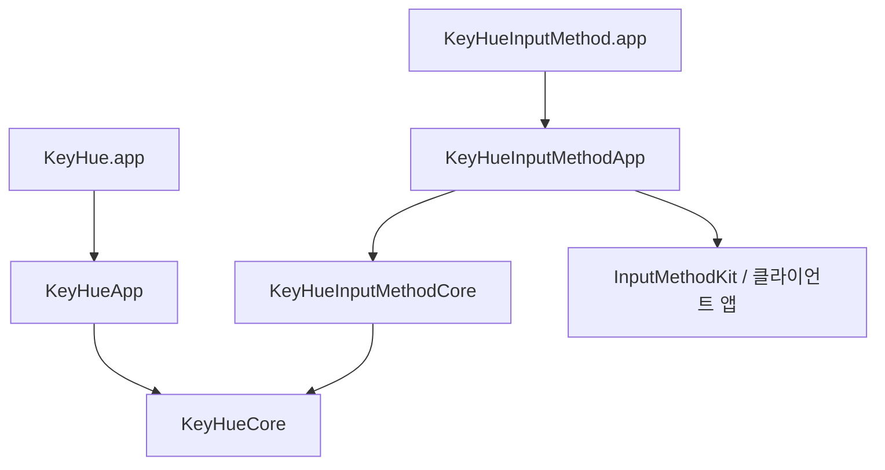

# KeyHue 실험적 입력기 설계

> 상태: 구현 전 설계. 2026-10-02 기준. 구조와 개발 순서는 [ADR 0045](adr/0045-experimental-input-method-component.md)로 결정했다. 이 문서의 신규 타깃·API·테스트·배포물은 계획이며 현재 제공되는 기능이 아니다.

## 1. 목표와 범위

KeyHue 입력기는 두벌식 한글과 QWERTY 영문을 직접 입력하고, 사용자가 켠 경우 잘못된 모드로 친 단어를 고쳐 준다. 기존 KeyHue 유틸리티와 같은 제품이지만, 설치·프로세스·입력 세션은 독립적이다.

첫 번째 사용 가능한 배포는 **자동 고침 없는 기본 입력기**다. 다음 배포에서 검증된 일반 텍스트 앱에 한해 **Space 경계의 영문→한글 고침과 즉시 되돌리기**를 제공한다. 기본 입력기가 안정화돼도 자동 고침은 별도로 실험적 상태를 유지할 수 있다.

초기 범위에 포함하지 않는 것:

- 세벌식, 다른 영문 배열, 한자 후보·변환, 일본어·중국어 등 추가 언어
- 기존 문서 전체의 분석·교정, 클립보드 변환, 원격 모델·학습·입력 기록
- 한글→영문 자동 고침, Return·Tab에서 고침, 치는 중 자동 교체
- 터미널·코드 편집기·비밀번호 필드의 자동 고침
- 유틸리티에 의한 자동 설치·기본 입력기 지정·실행 중 입력기 자동 교체

현재 말뭉치 결과는 후보 판정의 근거다. 실제 사용의 혼용·이름·약어·편집·되돌리기는 별도 평가한다. 두벌식 음절 왕복 테스트는 기본 조합 검증에 재사용하되 입력기 완성의 기준으로 쓰지 않는다.

## 2. 제품과 모듈 구조

| 구성 요소 | 책임 | 상태/의존성 |
|---|---|---|
| `KeyHueCore` | 공통 상태·두벌식 조합·언어 판정·모델 | 기존 모듈, AppKit/IMK 의존 없음 |
| `KeyHueApp` → `KeyHue` | 표시·알림·자동 전환·설정 UI → 유틸리티 진입점 | 기존 모듈, `KeyHueCore` 사용 |
| `KeyHueInputMethodCore` | 스트리밍 조합·편집·확정·고침·되돌리기 정책 | 신규 계획, `KeyHueCore`만 사용 |
| `KeyHueInputMethodApp` | IMK 서버/컨트롤러, 클라이언트·모드·설정 어댑터 | 신규 계획, IME Core와 공통 Core 사용 |
| `KeyHueInputMethod` | 입력기 서버를 시작하는 실행 파일 | 신규 계획, IME App 사용 |



입력기 → `KeyHueApp` 의존과 필수 런타임 IPC는 두지 않는다. 유틸리티 종료 상태에서도 입력·설정·고침·되돌리기를 사용할 수 있어야 한다. 공통 라이브러리는 각 실행 파일에 포함되며, 프로세스 간 입력 버퍼를 공유하지 않는다.

기존 `Dubeolsik.compose(keys:)`는 전체 키 문자열을 조합하는 함수다. 새 엔진은 이를 바탕으로 제한된 활성 키 버퍼의 재조합 또는 증분 상태를 구현한다. `committedUnits`는 조합상 안정된 접두사이지 클라이언트 문서에 이미 확정했다는 뜻이 아니다. 실제 확정 상태는 어댑터 실행 결과로 관리한다.

경고용 `MistypeWordTracker`는 편집기를 대신하지 않는다. `Dubeolsik`, `MistypeDetector`, `HangulSyllableModel`, `EnglishPrefixIndex`와 사전 프로토콜을 재사용하고, 입력기에는 별도의 편집·세션 상태를 만든다.

번들 이름은 `KeyHueInputMethod.app`으로 계획한다. 번들 ID 후보는 `io.github.sejoung.keyhue.inputmethod`다. 두 모드의 ID·표시 이름·연결 이름은 T단계에서 등록 가능성을 검증하고 첫 배포 전에 고정한다. Apple 입력 소스 ID와 충돌하면 안 된다.

## 3. 입력 세션과 이벤트 계약

Apple의 [IMKServer](https://developer.apple.com/documentation/inputmethodkit/imkserver)는 클라이언트 입력 세션마다 컨트롤러를 만든다. 이를 경계로 조합·고침 이력을 분리한다. 전역 버퍼 한 개로 여러 앱·필드의 입력을 처리하지 않는다.

세션이 소유하는 상태:

- 현재 모드, 활성 조합의 원래 키와 표시 문자열
- 이번 단어의 고침 가능 여부와 수동 모드 변경 여부
- 어댑터가 확인한 클라이언트·선택 영역·조합 영역·세션 세대 번호
- 방금 고친 단어 하나의 되돌리기 스냅샷: 원문, 고친 결과, 경계 문자, 이전 모드, 검증할 범위
- 사용자가 되돌린 단어를 같은 경계에서 다시 고치지 않기 위한 표시

세션 종료·포커스 변경 시 단어·고침 이력을 폐기한다. 공유하는 것은 읽기 전용 모델·사전과 입력 내용이 없는 설정뿐이다. 버퍼 상한은 T단계에서 정하고, 초과하면 고침을 중단하고 입력을 정상 확정한다. 긴 입력을 버리지 않는다.

계획 중인 계약은 **입력 이벤트 + 확인된 클라이언트 상태 → 새 엔진 상태 + 순서가 있는 편집 동작**이다. 예시 동작은 조합 표시, 원문 확정, 검증된 범위 교체, 모드 변경 요청, 키 전달이다. 실제 Swift 타입·메서드명은 기술 검증 이후 정한다.

어댑터는 편집 동작을 한 번만 적용하고 성공/실패를 엔진에 돌려준다. 실패한 교체를 재시도하거나 다른 앱에 뒤늦게 적용하지 않는다. 모드·세션이 바뀐 뒤 도착한 비동기 결과는 버린다. 기본 입력 경로는 판정 실패와 무관하게 진행돼야 한다.

## 4. 조합과 확정 정책

한글은 IMK 클라이언트의 marked text로 조합을 표현하고, 경계·클라이언트의 확정 요청에 따라 확정한다. [Apple의 조합 갱신 API](https://developer.apple.com/documentation/inputmethodkit/imkinputcontroller/updatecomposition%28%29)는 `setMarkedText`로 조합을 전달한다. 실제 콜백과 교체 API의 조합은 SDK와 대상 앱에서 검증한다.

| 이벤트 | 기본 입력의 계약 | 고침 이력 |
|---|---|---|
| 문자/Shift 문자 | 두벌식 조합 또는 QWERTY 영문 입력 | 이전 고침 되돌리기 무효화 |
| 조합 중 Backspace | 조합 키 한 단계 취소, 겹모음·겹받침도 단계별 복구 | 자동 고침을 새로 실행하지 않음 |
| 조합 없는 Backspace | 클라이언트의 일반 삭제 동작 | 유효한 즉시 되돌리기일 때만 예외 |
| Space | 조합 확정 + 공백 한 번 | 1단계에서만 고침 후보 판정 |
| Return/Tab | 조합 처리 후 클라이언트 동작 한 번 | 고침하지 않음 |
| 방향키/선택 변경/마우스 | 조합 종료 정책에 따라 처리 후 클라이언트에 전달 | 무효화 |
| Command/Control/Option 단축키 | 시스템·앱 단축키를 가로채지 않음 | 무효화 |
| 수동 모드 전환/ESC | 조합 확정·취소 순서를 검증해 적용 | 무효화, 수동 선택 우선 |
| 앱·필드 전환/세션 종료 | 클라이언트 요청과 맞춰 조합 처리 후 버퍼 폐기 | 무효화 |

일반 텍스트 입력에 필요한 숫자·기호·대문자는 지원한다. 고침 판정 대상에서 제외하는 것과 입력을 막는 것은 다르다. Caps Lock·키 반복·dead key·선택 영역을 덮어쓰는 입력·ESC 의미는 T/0단계에서 규칙과 테스트를 고정한다.

영문 모드의 두 구현 후보를 T단계에서 비교한다:

| 후보 | 장점 | 검증할 문제 |
|---|---|---|
| 단어 전체를 marked text로 유지 | 확정 전 고침이 쉽고 원래 키를 소유 | 자동 완성·선택·단축키·앱별 조합 UI와 충돌 가능 |
| 영문은 즉시 확정, 단어 끝에서 범위 교체 | 기본 영문 입력과 비슷한 동작 | 확정 범위 식별·교체·되돌리기의 앱 호환성 필요 |

0단계의 일반 영문 입력도 이 비교 결과를 바탕으로 구현한다. 1단계에서 고침을 켠다고 입력 지연·조합 동작이 달라진다면 그 차이를 후속 ADR과 사용자 안내에 명시한다. 안전한 교체를 보장할 수 없는 앱은 고침 대상에서 제외한다.

## 5. 자동 고침과 즉시 되돌리기

1단계의 사용자 계약:

```text
영문 모드, 고침 ON: dkssud + Space → 안녕␠, 다음 입력은 한글 모드
바로 Backspace:     안녕␠ → dkssud, 이전 영문 모드 복원
다시 Space:         dkssud␠, 방금 거부한 고침은 반복하지 않음
```

되돌리기는 고친 단어와 그 직후 공백을 원문으로 교체한다. 원문을 돌려놓기만 하는 동작이며 한 글자를 추가로 삭제하지 않는다. 다음 Backspace부터는 복원된 원문의 일반 편집 규칙을 따른다. Return로 제출된 명령·메시지를 되돌리는 기능으로 확장하지 않는다.

고침 조건:

1. 사용자가 옵션을 켰고, 검증된 앱/클라이언트이며 보안 입력이 아니다.
2. 이번 단어는 영문 모드의 편집되지 않은 후보다. 혼용·숫자·내부 구두점·지원하지 않는 modifier 상태·길이 초과는 제외한다. `API를`, 식별자, URL 등의 보수적인 제외 사례를 테스트로 고정한다.
3. 기존 판정기가 한글 후보로 판정한다. 자동 고침용 임계값은 실제 사례로 별도 검증하며 경고용 설정을 그대로 안전하다고 가정하지 않는다.
4. 같은 세션·선택 영역에서 원문을 교체할 수 있고, 모드 변경을 확인할 수 있다. 수동 변경과 경합하면 원문 입력을 유지한다.
5. 교체·공백 삽입·모드 반영 순서를 T단계 실험으로 고정한다. 각 효과는 한 번만 수행하며, 도중 실패 시 원문·모드로 복구 가능한 절차가 검증돼야 고침을 활성화한다.

되돌리기 시에는 세션 동일성, 커서가 결과 바로 뒤인지, 선택 영역이 비어 있는지, 제한된 범위의 내용이 예상 결과와 같은지 확인한다. 문자열 길이와 범위는 클라이언트 API의 UTF-16 기준으로 계산하고 이모지·결합 문자 앞뒤에서도 검증한다. 문서 전체를 읽지 않는다.

추가 입력, 커서·선택 변경, 마우스, 단축키, 모드 변경, 포커스 변경, 외부 편집으로 검증 조건이 깨지면 이력을 지운다. 상태를 확인할 수 없어도 되돌리기를 포기하고 일반 Backspace를 전달한다. 변경 결과를 앱이 다시 편집한 경우 추측해서 덮어쓰지 않는다.

IMK 교체·모드 전환은 하나의 원자적 트랜잭션이라고 가정하지 않는다. 고침 실패가 원문 유실·공백 중복·모드 불일치를 만들면 1단계 배포 차단 결함이다.

## 6. 유틸리티와 설정 연동

- 입력기는 macOS 입력 소스에서 선택하고, 유틸리티 없이 자신의 메뉴에서 고침 ON/OFF를 바꿀 수 있게 한다. 설정은 입력기 전용 도메인과 버전 있는 스키마로 관리하며 입력 문자열은 저장하지 않는다.
- 유틸리티의 색·HUD·기본 입력 소스·앱/창별 복원은 **확인된 입력 소스/모드**를 기준으로 한다. 두 IME 모드가 TIS에 구분돼 노출되는지, 외부 전환이 실제 선택으로 이어지는지 T단계에서 확인한다.
- TIS만으로 확인할 수 없으면 최소 모드 상태 연동을 후속 ADR로 정한다. 입력 내용은 전송하지 않고, 유틸리티가 없거나 연결이 끊겨도 입력기는 동작한다. 키 이벤트만으로 상태를 추정하지 않는다.
- 입력기 선택 중에는 유틸리티의 기존 경고 추적을 중단하고 남은 경고를 지운다. 입력기 고침이 OFF여도 중복 경고를 자동으로 켜지 않는다. 경고 통합은 이후 별도 선택이다.
- 기존 `MistypeSupport`의 Apple 입력 소스 ID만 늘리는 방식은 연동 완료로 보지 않는다. 기존 자동 전환, 직접 모드 변경, 앱별 복원과 경합하는 사례를 확인한다.

## 7. 개인정보·실행 경로

입력기는 사용자가 선택한 동안 자신에게 전달된 입력을 처리한다. 다른 앱의 전체 문서·키 입력을 전역 수집하지 않는다. 보안 입력 여부·클라이언트 능력을 확실히 확인할 수 없으면 고침을 허용하지 않는다. 비밀번호 입력은 시스템 입력 소스의 동작과 함께 검증한다.

원문·후보·조합 키·되돌리기 이력은 제한된 메모리에만 둔다. 진단 로그·설정·크래시 보조 파일에 명시적으로 기록하지 않는다. 로그는 세션 수명 주기, 실패 분류, 버전 등 입력 내용이 없는 정보만 허용한다. 피드백 예시는 사용자가 직접 작성해 제공한다.

모델·접두사 인덱스는 시작 시 준비하고 키 처리 경로에서 파일·네트워크 로드나 무제한 사전 조회를 하지 않는다. 시스템 사전 API의 지연도 측정한다. 준비되지 않은 판정 결과를 기다려 입력을 막지 않는다. 키 처리의 직렬 순서·Swift 6 동시성·SDK 콜백 실행 문맥은 T단계에서 검증한다.

공통 한국어 음절 모델은 기존 [CC BY-SA 4.0 라이선스](../Resources/Mistype/LICENSE)와 출처를 입력기 아티팩트에도 포함한다. 코드의 MIT 라이선스와 구별한다.

## 8. 단계와 완료 기준

| 단계 | 산출물 | 다음 단계로 넘어가는 기준 |
|---|---|---|
| T — 기술 검증 | 최소 IMK 실험 번들, 관찰 결과, 후속 ADR | 두 모드 등록·실제 전환, 조합/확정/교체/되돌리기, 영문 버퍼 정책, 설치·서명·복구 경로 확인 |
| 0 — 기본 입력 | 선택 설치 가능한 두벌식·영문 실험 입력기, 고침 OFF | 조합·Backspace·기호·단축키·커서·세션 테스트 통과, 지원 앱의 입력 유실/중복/다른 세션 수정/단축키 차단 미해결 결함 0 |
| 1 — 단어 끝 고침 | 검증된 앱의 Space 영문→한글 고침, 즉시 되돌리기 | 고침·실패 복구·모드 동기화·범위 검증 테스트 통과, 실제 오탐/되돌리기 평가와 공개 사용 제한 |
| 2 — 치는 중 판정 | 조기 경고/후보 또는 교체의 별도 설계·평가 | 1단계 사용 자료와 별도 ADR, 흔한 영어 접두사·혼용 보호·되돌리기 기준 확인 |

T단계 체크리스트:

- [ ] IMK 번들 등록, 영문/두벌식 모드 ID, TIS 선택·알림, 유틸리티의 색·복원 확인
- [ ] AppKit 텍스트 앱과 웹/Electron 앱에서 조합·확정·선택 영역·교체 범위 관찰
- [ ] 영문 버퍼 두 후보와 앱 자동 완성·단축키 영향 비교
- [ ] 고침 + 공백 + 모드 전환의 순서, 부분 실패 복구, 즉시 되돌리기 실험
- [ ] 세션 종료·클라이언트 확정 요청·입력기 종료/재시작·유틸리티 종료 사례 확인
- [ ] Swift 6/지원 SDK의 API·스레드·Objective-C 클래스 등록과 번들 메타데이터 확인
- [ ] 서명·첫 설치·업데이트·제거·시스템 입력 소스로 복귀 절차 확인
- [ ] 실험 결과와 지원 앱 표를 남기고 0/1단계의 버퍼·교체 계약을 후속 ADR로 확정

단계를 시작할 때 실제 지원 macOS·SDK·CPU 조합을 적는다. 현재 프로젝트의 최소 대상은 macOS 13이지만 IMK 지원 검증이 끝났다는 뜻은 아니다. 사용할 API가 최소 OS와 맞지 않으면 지원 범위를 별도 결정한다.

2단계는 [ADR 0042](adr/0042-warn-while-typing.md)의 조기 판정 자산을 활용한다. 기존 조기 **경고**의 임계값을 조기 **교체** 허가로 해석하지 않는다. 한글→영문 고침도 1단계에 끼워 넣지 않고 평가 후 별도 범위로 정한다.

## 9. 검증 계획

| 층 | 계획 중인 검사 |
|---|---|
| 공통 조합 | 기존 11,172 음절 왕복 테스트, 겹모음·겹받침·받침 넘기기 |
| IME Core | 입력/삭제/확정의 상태 전이, 원문 유지, 경계 한 번, 모드 우선순위, 세션 분리, 길이 상한 |
| 어댑터 | 가짜 클라이언트의 선택·UTF-16 범위·외부 편집·교체 실패, 같은 이벤트 중복 처리 금지 |
| 실제 앱 | 조합 UI·일반 입력·단축키·자동 완성·선택 덮어쓰기·앱/창 이동·고침/되돌리기 |
| 배포·수명 주기 | 첫 설치·등록·교체·제거·재시작·유틸리티 없는 실행·시스템 ABC로 복귀 |
| 성능·판정 | 키 처리 지연·사전 준비 시간·메모리 상한, 실제 사례의 오탐·누락·되돌리기 성공 |

실제 앱의 초기 검증 대상은 TextEdit, Notes, Safari/Chrome 텍스트 필드, VS Code, Terminal이다. 웹 편집기와 Electron은 별도 사례로 기록한다. VS Code·Terminal은 기본 입력 호환성 대상이며, 1단계 자동 고침 허용 대상은 아니다. 앱 이름만으로 허용하지 않고 확인한 버전·클라이언트 유형·경우를 지원 표에 남긴다.

자동 테스트는 가짜 시간과 클라이언트를 사용한다. 실제 IMK 콜백·앱 동작은 수동/통합 테스트로 구분하고, 기존 `swift test`가 이 전체 경로를 이미 검증한다고 표시하지 않는다. 신규 테스트와 번들 검증은 타깃 구현 시 [TESTING.md](TESTING.md)와 검증 스크립트에 연결한다.

평가는 후보 수, 제외 수와 이유, 수행한 고침 수, 잘못 고친 수, 되돌리기 시도/성공 수를 구별한다. 테스트용 직접 작성 사례와 사용자가 제공한 예시로 평가하고 입력 기록을 자동 수집하지 않는다. 지연·오탐의 수치 목표는 T단계 기준 측정 뒤 1단계 구현 전에 고정한다. 검증 불가능한 범위 교체와 입력 유실·중복은 수치 평균으로 상쇄하지 않는다.

## 10. 설치·업데이트·복구

실험 배포는 유틸리티 ZIP과 구분되는 입력기 아티팩트로 제공한다. 사용자가 설치한 뒤 macOS 입력 소스에서 명시적으로 추가·선택한다. 기존 Apple ABC와 두벌식은 남겨 둔다.

사용자별 설치 위치 후보는 `~/Library/Input Methods/KeyHueInputMethod.app`이다. 사용자가 명시적으로 실행하는 설치 스크립트는 T단계에서 등록·캐시·교체 동작을 확인한 후 설계한다. 재로그인·재시작 필요 여부를 검증 없이 단정하지 않는다. 실험은 별도 테스트 계정/환경에서 시작한다.

입력기 버전·번들 버전·호환 설정 스키마를 별도로 명시한다. 실험 릴리즈는 유틸리티의 정식 `vX.Y.Z` 업데이트 안내로 섞이지 않도록 태그·아티팩트 규칙을 정한다. [ADR 0044](adr/0044-update-check-and-release-link.md)의 확인 기능은 현재 유틸리티용으로 유지한다.

업데이트·제거 안내는 **시스템 ABC로 전환 → 활성 조합 종료 확인 → 입력기 등록/실행 상태 확인 → 해당 번들 교체 또는 제거 → 재선택·확인** 흐름을 검증한다. 실패하면 시스템 입력 소스로 돌아가 일상 입력을 계속할 수 있어야 한다. 사용자 설정 삭제는 별도 선택이며 다른 입력기·문서를 건드리지 않는다.

자체 서명·ad-hoc·Developer ID/공증의 배포 가능성과 첫 실행 안내는 입력기 자체로 검증한다. 기존 유틸리티의 TCC 권한 유지 실험을 입력기 등록·교체의 증거로 쓰지 않는다. 유료 멤버십 도입이나 입력기 자동 업데이트는 필요할 때 후속 ADR로 결정한다.

## 11. 결정을 다시 열 때

모듈/프로세스 경계, 기본 OFF, 개인정보 범위, 단계 순서와 교체 안전 조건은 ADR 0045의 결정이다. 이를 바꾸려면 새 ADR에 이유·증거·이전 결정에 미치는 범위를 적는다.

T단계 결과로 정할 항목은 영문 버퍼 정책, 구체적인 클라이언트 API와 호출 순서, 모드 ID·상태 연동, 입력 버퍼 상한, 지원 앱 표, 성능 목표, 설치·실험 버전 규칙이다. 후속 ADR을 이 문서에서 연결하고, 검증되지 않은 항목을 구현 완료로 바꾸지 않는다.

## 참고

- 결정: [ADR 0045](adr/0045-experimental-input-method-component.md)
- 조합·판정·경고: [0040](adr/0040-mistype-language-detection-phase0.md), [0041](adr/0041-wrong-language-warning.md), [0042](adr/0042-warn-while-typing.md)
- Apple: [IMKServer 초기화와 번들 키](https://developer.apple.com/documentation/inputmethodkit/imkserver/init%28name%3Abundleidentifier%3A%29), [IMKInputController](https://developer.apple.com/documentation/inputmethodkit/imkinputcontroller), [NSTextInputClient](https://developer.apple.com/documentation/appkit/nstextinputclient)
